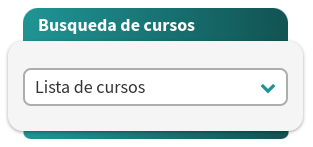
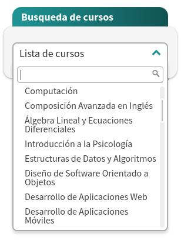
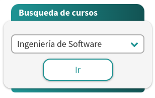
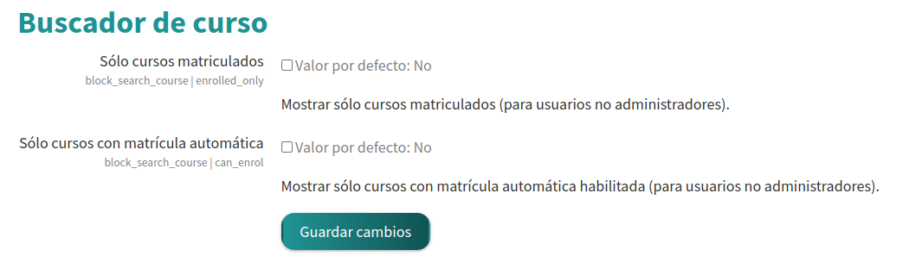

# BLOCK Search Course

---

Package tested in: moodle 4.0.1+

## QUICK INSTALL

---

Donwload zip packag, extract the search_course folder and upload this folder into /blocks/

## ABOUT

---

* **Developed by:** soporte@escueladidactica.com
* **GIT:** https://github.com/labtica/moodle-search_courses
* **Powered by:** Escuela Didáctica
* **Documentation:** [En](https://www.escueladidactica.com/course-search-configuration-instructions/)-[Es](https://www.escueladidactica.com/instructivo-configuracion-de-busqueda-de-cursos/)

## IN VERSION

---

### 2021050701

* Through this component, users have the possibility to access a drop-down list showing all the courses they are enrolled in, organized by category. Selecting one of the courses in the list will activate a button that will instantly direct them to the chosen course.
